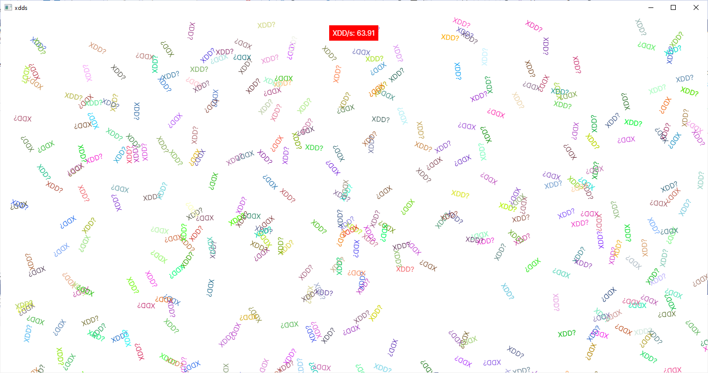
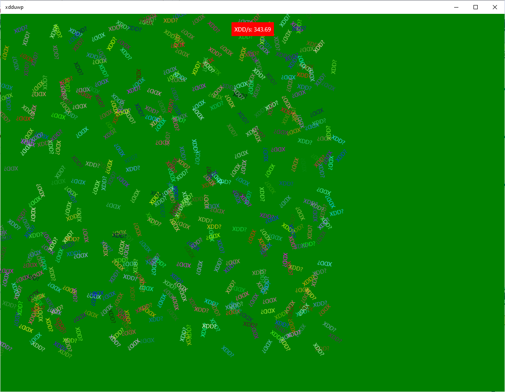

# xdds

Measure how much XDDs Avalonia can render. This is a nod to https://github.com/jonathanpeppers/lols which itself nods to
- https://github.com/maxim-saplin/dopetest_xamarin
- https://github.com/maxim-saplin/dopetest_flutter
- https://github.com/unoplatform/performance/tree/master/src/dopes/DopeTestMaui

# Measurements

```
Intel(R) Core(TM) i7-3630QM CPU @ 2.40GHz   2.40 GHz
16Gb RAM
```

63.91 xdds per second



61 xdds per second



